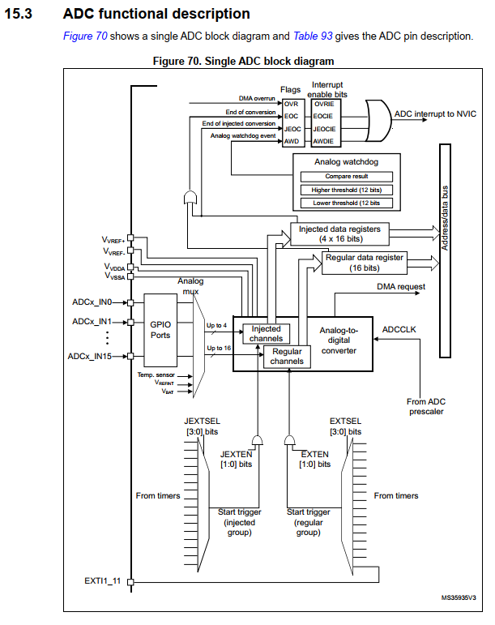
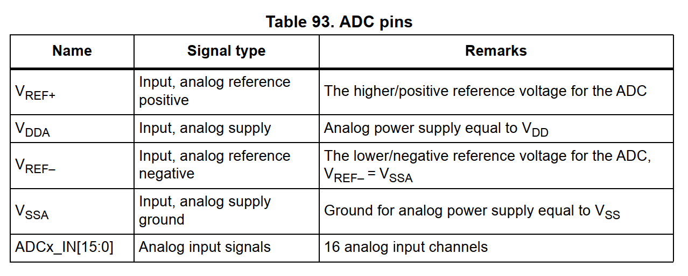

# Analog-to-digital converter (ADC)

## ADC introduction

The 12-bit ADC is a successive approximation analog-to-digital converter. It has up to 19 multiplexed channels allowing it to measure signals from 16 external sources, two internal sources (Temperature sensor/VREFINT), and the VBAT channel. 

**Key Concepts for Beginners:**
- **Successive Approximation (SAR):** Think of this as a binary search for the voltage level. The ADC "guesses" the value bit by bit to find the closest match.
- **Resolution (12-bit):** The ADC converts an analog voltage into a digital number between `0` and `4095` (2^12 - 1).
- **Modes:** You can convert one channel once (**Single**), one channel repeatedly (**Continuous**), or a list of different channels (**Scan**).

The result of the ADC is stored in a 16-bit data register, which can be **Left-aligned** or **Right-aligned** (standard for most math).

## ADC main features
- **Configurable Resolution:** 12-bit, 10-bit, 8-bit, or 6-bit. Lower resolution is faster.
- **Interrupts:** Triggered at the end of conversion or if a voltage goes outside a set range (Analog Watchdog).
- **Scan Mode:** Automatically jumps from channel 0 to channel ‘n’.
- **Sampling Time:** Programmable per channel. Some signals need more time to "settle" before measuring.
- **External Triggers:** Start a conversion using a timer or an external pin instead of software.
- **DMA Support:** Automatically moves data to memory so the CPU doesn't have to wait.

## ADC on-off control
The ADC is powered on by setting the **ADON** bit in the `ADC_CR2` register. 
- **Wake up:** When **ADON** is set for the first time, it wakes the ADC from Power-down mode.
- **Start:** Conversion actually starts when you set the **SWSTART** (Regular) or **JSWSTART** (Injected) bit.
- **Power down:** Clear **ADON** to save power (consumes only a few µA).

## ADC clock
The ADC uses two clocks:
1. **Analog Clock (ADCCLK):** Used for the actual conversion process. It comes from **PCLK2** (APB2) divided by a prescaler (`/2`, `/4`, `/6`, or `/8`). **Must not exceed 14 MHz** (refer to datasheet).
2. **Digital Interface Clock:** Used for reading/writing registers. This is equal to the **APB2** clock and must be enabled in the `RCC_APB2ENR` register before accessing ADC registers.

---

## ADC functional description

*Figure 1: Single ADC Block Diagram*

*Figure 2: ADC Pin Description*

### Describing the Block Diagram

#### ADCx_IN0 ... ADCx_IN15
These are the physical input pins.
- **What it is:** The actual copper pins on the chip where you connect your sensors.
- **Implementation:** To use these, the corresponding GPIO pin must be set to **Analog Mode** in the `GPIOx_MODER` register. This disconnects the digital input/output circuitry to prevent interference with the tiny analog signals.

#### GPIO Ports
- **Ports used:** Typically PA0-PA7, PB0-PB1, PC0-PC5, etc., depending on the specific STM32 package.
- **Implementation:** 
    1. Enable the GPIO port clock in `RCC_AHB1ENR`.
    2. Set the Pin Mode to `0b11` (Analog) in `GPIOx_MODER`.

#### Analog Mux (Multiplexer)
- **What it is:** Think of this as a "switchboard" or a "rotary switch". 
- **Relevance to code:** You don't "code" the mux directly; instead, you tell the ADC which channels you want to see in the **Sequence Registers** (`ADC_SQRx` for regular, `ADC_JSQR` for injected). The hardware then switches the mux automatically during a scan.
- **Input/Output:** It takes multiple analog inputs (IN0-IN15) and outputs **one** signal at a time to the ADC converter core.

#### Injected Channels
- **What it is:** High-priority channels that can "inject" themselves into a regular conversion. Think of them like an **Interrupt** for the ADC.
- **How they work:** If a regular scan is running and an injected trigger occurs, the regular scan is paused, the injected channels (up to 4) are converted, and then the regular scan resumes.
- **Storage:** Results are stored in their own dedicated registers: `ADC_JDR1` through `ADC_JDR4`.

#### Regular Channels
- **What it is:** The standard "queue" for conversions. 
- **How they work:** You can define a sequence of up to 16 channels. The ADC converts them one by one in the order you specify in `ADC_SQR1-3`.
- **Storage:** All regular conversion results are written to a **single** register: `ADC_DR`.

#### JEXTSEL and EXTSEL (External Trigger Select)
- **What it is:** Selectors for *what* starts the conversion.
- **How they work:** Instead of writing code to start the ADC (`SWSTART`), you can link it to a hardware event.
- **Timer Triggers:** You can start the ADC exactly when a Timer overflows or reaches a certain count. This is crucial for precise control loops (e.g., measuring motor current exactly at the peak of a PWM signal).
- **EXTI11/15:** These allow external physical pins to trigger the ADC.

#### JEXTEN and EXTEN (External Trigger Enable)
- **What it is:** These bits act as the "Master Switch" and "Edge Selector" for the triggers above.
- **How they work:** You can set them to trigger on the **Rising Edge**, **Falling Edge**, or **Both** of the selected trigger source.

#### ADCCLK (Prescaler)
- **What it is:** The clock frequency used for the analog circuitry.
- **How it works:** It is derived from the APB2 clock. You set the division factor (`/2`, `/4`, `/6`, `/8`) in the `ADC_CCR` (Common Control Register).
- **Importance:** If the clock is too fast, the conversion will be inaccurate. If it's too slow, it takes longer to get a reading.

#### DMA Request
- **What it is:** A signal sent to the Direct Memory Access (DMA) controller.
- **How it works:** Because `ADC_DR` (Regular Data Register) is only one register, every new conversion overwrites the previous one. The **DMA Request** tells the DMA controller: "New data is ready! Come grab it and move it to an array in RAM before the next conversion finishes."

#### Injection Data Registers (JDRx)
- **Inputs:** Digital output from the ADC core.
- **Outputs:** The data bus for the CPU to read.
- **Address/Data Bus:** This is the internal "highway" that connects the registers to the CPU.
- **JEOC (End of Injected Conversion):** A flag that tells the system "All injected channels in the sequence are done."

#### Regular Data Register (DR)
- **Inputs:** Digital output from the ADC core.
- **Outputs:** The data bus for the CPU to read.
- **EOC (End of Conversion):** A flag that tells the system "One regular channel conversion is done."

#### Analog to Digital Converter (The Core)
- **VREF+ / VREF-:** The "Measuring Stick". If VREF+ is 3.3V and VREF- is 0V, then a 3.3V input results in 4095.
- **VDDA / VSSA:** Power supply for the analog hardware.
- **Why only channels inside?** The core is the only part that does the actual voltage-to-number math. Everything else (Mux, Sequencer) is just getting the signal to the door.

#### Flags
- **Input:** Internal status signals from the conversion core and sequencers.
- **Flags include:** 
    - **EOC:** Regular conversion complete.
    - **JEOC:** Injected sequence complete.
    - **OVR (Overrun):** New data arrived before the old data was read.

#### Interrupt Enable Bits
- **How they work:** Bits like `EOCIE` and `JEOCIE` in the `ADC_CR1` register act as "gatekeepers". If the bit is set (1), the corresponding flag will send a signal to the NVIC.

#### ADC Interrupt to NVIC
- The final signal sent to the **Nested Vectored Interrupt Controller**. This causes the CPU to pause its current task and jump to the ADC Interrupt Service Routine (ISR) in your code.

---

### ADC pins

- **VREF+:** Positive reference. Sets the "maximum" voltage the ADC can see.
- **VDDA:** Analog power supply. Should be connected to VDD (usually 3.3V) but filtered for noise.
- **VREF–:** Negative reference. Usually tied to Ground (VSSA).
- **VSSA:** Analog ground. 
- **ADCx_IN[15:0]:** The 16 external channels. Note that some channels are shared between ADC1, ADC2, and ADC3.
